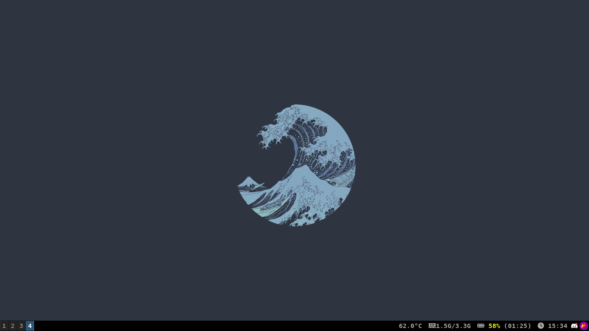
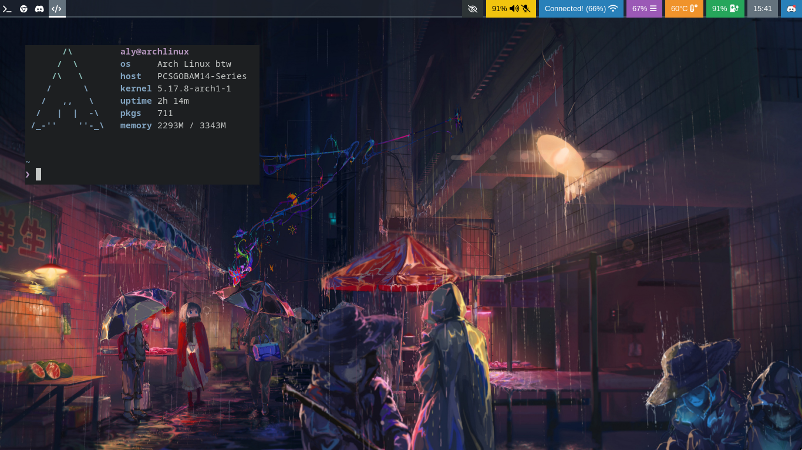

# Sleeping Tali

## To install & use

This should work very well :)

```
git clone https://github.com/TaliAly/SleepingTali.git
cd SleepingTali
sh main.sh
```

or in one line

```
git clone https://github.com/TaliAly/SleepingTali.git && cd SleepingTali && sh main.sh
```

<br />
<hr />

### why?

This is more of a simple way to get started with my machines, since I don't want to keep making everything from scratch I can just update this time to time to get the things I need and boom, I don't need to worry about hoping to have everything installed.

But also yeah, don't expect a lot from me since I don't use bash too much, I know how to move around with it and use it but I'm not a *pro* at this haha.

Anyways, you can do whatever you want, I don't mind since this is for me


<hr />
<div>
    
    
</div>